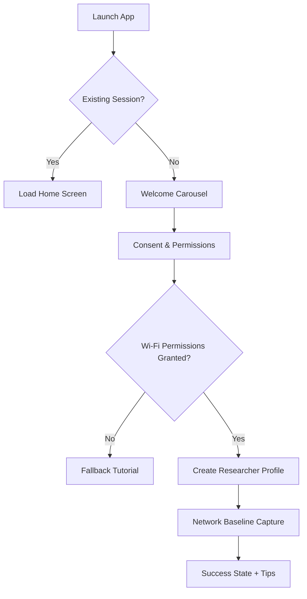
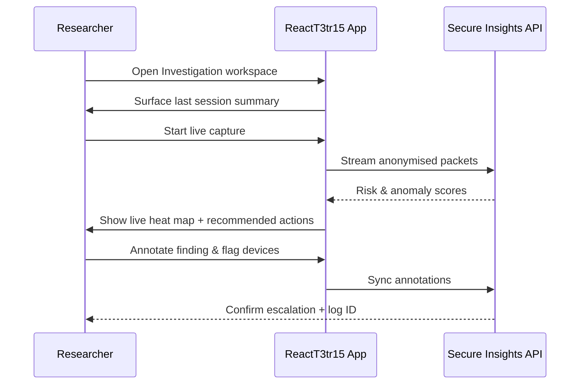
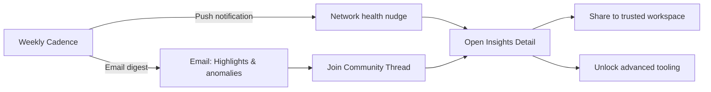

# Product User Flows & Wireframes

This document summarises the user journeys captured in the Figma file `Figma › ReactT3tr15 • Diagnostic Companion`. The exported wireframes that map to each journey live alongside this document under [`./wireframes`](./wireframes).

- [`onboarding.svg`](./wireframes/onboarding.svg) — funnel from first launch through permissions and account creation.
- [`core-loop.svg`](./wireframes/core-loop.svg) — daily diagnostic workflow and escalation loop.
- [`retention-hooks.svg`](./wireframes/retention-hooks.svg) — notification, insights, and community hooks that keep researchers engaged.

Each frame was constructed in Figma with Auto Layout so that the components defined in our NativeWind library map 1:1 to the screen structure. The following high-level flows mirror the structure encoded in the Figma prototype.

## Onboarding Journey

### Key Wireframe Moments

1. **Welcome carousel** introduces value prop with progress indicator and skip CTA.
2. **Permission sheet** uses our `Surface/Card` components with inline rationale text and CTA row.
3. **Baseline capture** screen uses stacked metrics tiles to reassure the user that diagnostics are underway.

## Core Diagnostic Loop

### Core Screens

- **Workspace overview**: segmented controls to switch between Sites, Devices, and Sessions.
- **Live capture**: hero chart using Skia heatmap + collapsible detail cards.
- **Annotation drawer**: bottom sheet with quick-tag chips and timeline playback control.

## Retention Hooks

### Hooks Implemented in Figma

- **Scheduled notification modal**: emphasises SLA breaches using accent colour tokens.
- **Insights digest email preview**: created with shared typography primitives for brand cohesion.
- **Community thread view**: reuses chip component for filters and highlights leaderboard placement.

## Interaction Notes

- Every navigation step is wired with Figma prototypes (tap + smart animate) matching the animation specs documented in [`animations.md`](./animations.md).
- Inputs follow the `TextField` component guidelines ensuring keyboard-safe areas are preserved on both iOS and Android frames.

## Next Steps

- Validate flows during moderated testing (see [`usability-testing.md`](./usability-testing.md)).
- Feed approved interaction specs into the implementation backlog as described in [`component-library.md`](./component-library.md).
